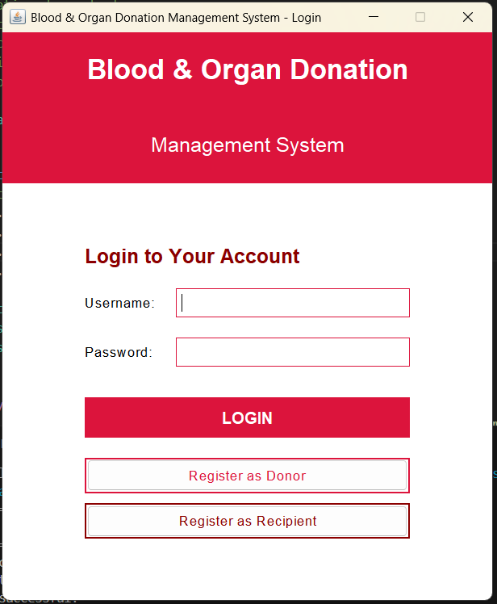
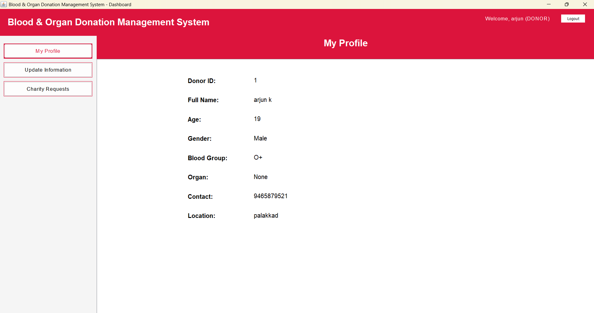
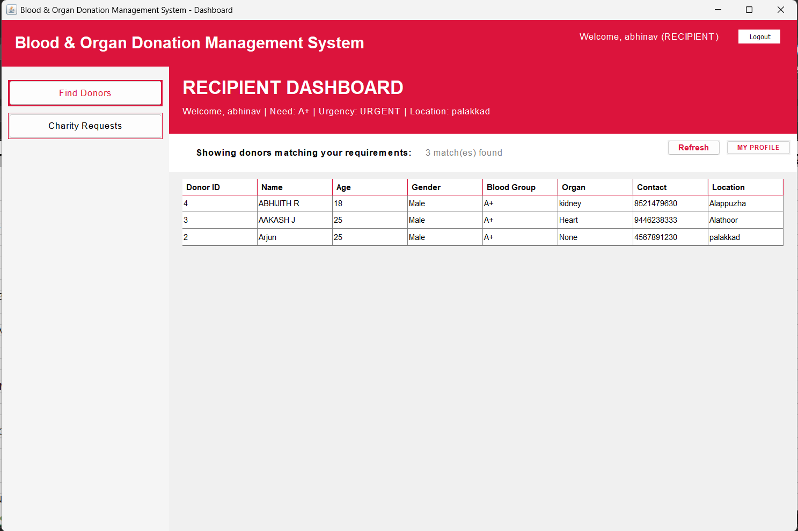
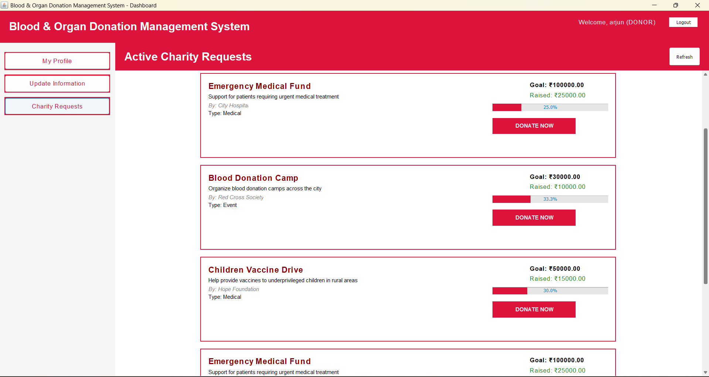

<div align="center">

# 🩸 Blood and Organ Donation Management System

[](https://www.oracle.com/java/)
[](https://www.mysql.com/)
[](CONTRIBUTING.md)

**A comprehensive desktop application for managing blood and organ donations, built with Java Swing and MySQL**

[Features](#-features) • [Installation](#-installation) • [Usage](#-usage) • [Documentation](#-documentation) • [Contributing](#-contributing)

</div>

---

## 🌟 Overview

The **Blood and Organ Donation Management System** is a comprehensive desktop application designed to streamline the process of blood and organ donation management. Built with Java Swing for the GUI and MySQL for data persistence, this system demonstrates professional software engineering practices and core Object-Oriented Programming principles.

### Key Highlights

✅ **Multi-Role System** - Separate interfaces for Donors, Recipients, and Receptionists  
✅ **Real-time Search** - Advanced filtering by blood group, organ type, and location  
✅ **Charity Management** - Create and manage charity requests with integrated payment gateway  
✅ **Secure Authentication** - Role-based access control with session management  
✅ **Data Validation** - Comprehensive input validation and error handling  
✅ **Professional UI** - Modern, intuitive interface with consistent design patterns

---

## 🚀 Features

### 👤 Donor Module
- **Registration & Authentication** - Secure donor registration with unique credentials
- **Profile Management** - Update personal information, blood group, and organ donation preferences
- **Donation History** - Track all blood/organ donations and charity contributions
- **Charity Participation** - Browse and contribute to active charity requests
- **Dashboard** - Personalized dashboard with quick access to all features

### 🏥 Receptionist Module
- **Donor Search** - Advanced search and filtering by blood group, organ type, location
- **Recipient Management** - Register and manage recipients requiring blood/organs
- **Donor-Recipient Matching** - Intelligent matching based on compatibility
- **Reports & Analytics** - View donation statistics and generate reports
- **Charity Management** - Create and manage charity campaigns

### 💝 Recipient Module
- **Registration** - Register as a recipient with medical requirements
- **Donor Search** - Search for compatible donors by blood group and organ type
- **Urgency Levels** - Specify urgency level (Normal, Urgent, Critical)
- **Medical Information** - Store and manage medical condition details
- **Contact Management** - Direct communication with matched donors

### 💰 Charity Module
- **Campaign Creation** - Create charity requests with goals and descriptions
- **Payment Integration** - Mock payment gateway (UPI, Demo Payment)
- **Donation Tracking** - Real-time tracking of donations and progress
- **Campaign Status** - Active/Completed status management
- **Donation History** - Complete audit trail of all contributions

---

## 🛠️ Technology Stack

| Component | Technology |
|-----------|-----------|
| **Language** | Java (JDK 8+) |
| **GUI Framework** | Java Swing |
| **Database** | MySQL 8.0+ |
| **Database Connectivity** | JDBC (Java Database Connectivity) |
| **Design Pattern** | MVC (Model-View-Controller), Singleton, DAO |
| **Build Tool** | Manual compilation (scripts provided) |
| **Version Control** | Git |

---

## 🎯 OOP Concepts Demonstrated

This project serves as an excellent demonstration of core Object-Oriented Programming principles:

### 1. **Encapsulation** 🔒
- Private attributes with public getter/setter methods
- Data hiding in model classes (`User`, `Donor`, `Recipient`)
- Protected database credentials in `DatabaseConnection`

```java
public class User {
    private int userId;
    private String username;
    private String password;
    
    public int getUserId() { return userId; }
    public void setUserId(int userId) { this.userId = userId; }
}
```

### 2. **Inheritance** 🌳
- Base `User` class extended by `Donor`, `Recipient`, and `Receptionist`
- Code reusability and hierarchical relationships
- Method inheritance and constructor chaining

```java
public class Donor extends User {
    private String bloodGroup;
    private String organ;
    // Donor-specific attributes and methods
}
```

### 3. **Polymorphism** 🎭
- Method overriding in subclasses
- Interface implementation (`PaymentGateway`)
- Runtime polymorphism in search functionality

```java
public interface PaymentGateway {
    boolean processPayment(double amount, String details);
}

public class UPIPaymentGateway implements PaymentGateway {
    @Override
    public boolean processPayment(double amount, String details) {
        // UPI-specific implementation
    }
}
```

### 4. **Abstraction** 🎨
- `PaymentGateway` interface with multiple implementations
- Abstract data access through DAO pattern
- Hiding complex implementation details

---

## 🏗️ System Architecture

```
┌─────────────────────────────────────────────────────────┐
│                    Presentation Layer                    │
│         (Java Swing GUI - LoginFrame, Dashboard)         │
└─────────────────────┬───────────────────────────────────┘
                      │
┌─────────────────────▼───────────────────────────────────┐
│                    Business Logic Layer                  │
│     (Models, Validation, Session Management, Utils)      │
└─────────────────────┬───────────────────────────────────┘
                      │
┌─────────────────────▼───────────────────────────────────┐
│                    Data Access Layer                     │
│           (DAO Classes, Database Connection)             │
└─────────────────────┬───────────────────────────────────┘
                      │
┌─────────────────────▼───────────────────────────────────┐
│                    Database Layer                        │
│                    (MySQL Database)                      │
└─────────────────────────────────────────────────────────┘
```

---

## 📦 Installation

### Prerequisites

Before you begin, ensure you have the following installed:

- **Java Development Kit (JDK) 8 or higher**
  ```bash
  java -version
  ```

- **MySQL Server 8.0 or higher**
  ```bash
  mysql --version
  ```

- **MySQL JDBC Driver** (included in `lib/` folder)

### Step-by-Step Installation

#### 1. Clone the Repository

```bash
git clone https://github.com/ARJYUN/Blood-and-Organ-Donation-Management.git
cd Blood-and-Organ-Donation-Management
```

#### 2. Set Up MySQL Database

**Option A: Using the SQL Script**
```bash
mysql -u root -p < database_schema.sql
```

**Option B: Manual Setup**
```sql
-- Login to MySQL
mysql -u root -p

-- Create database
CREATE DATABASE IF NOT EXISTS blood_organ_donation;
USE blood_organ_donation;

-- Run the database_schema.sql file
source database_schema.sql;
```

#### 3. Configure Database Connection

Edit `src/database/DatabaseConnection.java`:

```java
private static final String URL = "jdbc:mysql://localhost:3306/blood_organ_donation";
private static final String USER = "root";
private static final String PASSWORD = "your_mysql_password";
```

#### 4. Add MySQL JDBC Driver

Ensure `mysql-connector-java-x.x.x.jar` is in the `lib/` folder.

#### 5. Compile the Project

**Windows:**
```bash
compile.bat
```

**Linux/Mac:**
```bash
chmod +x compile.sh
./compile.sh
```

#### 6. Run the Application

**Windows:**
```bash
run.bat
```

**Linux/Mac:**
```bash
chmod +x run.sh
./run.sh
```

---

## ⚙️ Configuration

### Database Configuration

Update the following in `src/database/DatabaseConnection.java`:

```java
// Database URL
private static final String URL = "jdbc:mysql://localhost:3306/blood_organ_donation";

// Database credentials
private static final String USER = "root";
private static final String PASSWORD = "your_password";
```

### Default Credentials

| Role | Username | Password |
|------|----------|----------|
| Receptionist | `admin` | `admin123` |

> **Note:** Change default credentials after first login for security.

---

## 💻 Usage

### Starting the Application

1. Launch the application using `run.bat` (Windows) or `run.sh` (Linux/Mac)
2. The login screen will appear
3. Choose your role and login or register

### For Donors

1. **Register** - Click "Register as Donor" on login screen
2. **Login** - Use your credentials to access donor dashboard
3. **Update Profile** - Manage your blood group, organ donation preferences
4. **View Charities** - Browse and contribute to charity campaigns
5. **Track History** - View your donation history

### For Recipients

1. **Register** - Click "Register as Recipient" on login screen
2. **Login** - Access recipient dashboard
3. **Search Donors** - Find compatible donors by blood group/organ
4. **Manage Profile** - Update medical information and urgency level

### For Receptionists

1. **Login** - Use admin credentials (`admin`/`admin123`)
2. **Search Donors** - Advanced search with multiple filters
3. **Manage Recipients** - Register and manage recipients
4. **Create Charities** - Launch new charity campaigns
5. **View Reports** - Access donation statistics and reports

---

## 📁 Project Structure

```
Blood-and-Organ-Donation-Management/
│
├── src/
│   ├── MainApplication.java          # Application entry point
│   │
│   ├── models/                        # Data models (OOP classes)
│   │   ├── User.java                  # Base user class
│   │   ├── Donor.java                 # Donor model (extends User)
│   │   ├── Recipient.java             # Recipient model (extends User)
│   │   ├── Receptionist.java          # Receptionist model (extends User)
│   │   ├── CharityRequest.java        # Charity request model
│   │   └── Donation.java              # Donation model
│   │
│   ├── database/                      # Data access layer
│   │   ├── DatabaseConnection.java    # Singleton DB connection
│   │   ├── UserDAO.java               # User data access
│   │   ├── DonorDAO.java              # Donor data access
│   │   ├── RecipientDAO.java          # Recipient data access
│   │   ├── CharityDAO.java            # Charity data access
│   │   └── DonationDAO.java           # Donation data access
│   │
│   ├── gui/                           # Swing GUI components
│   │   ├── LoginFrame.java            # Login screen
│   │   ├── MainDashboard.java         # Main dashboard
│   │   ├── DonorRegistrationFrame.java
│   │   ├── RecipientRegistrationFrame.java
│   │   ├── DonorProfilePanel.java
│   │   ├── DonorUpdatePanel.java
│   │   ├── RecipientDashboardPanel.java
│   │   ├── ReceptionDashboardPanel.java
│   │   ├── SearchDonorsPanel.java
│   │   ├── ViewDonorsPanel.java
│   │   ├── CharityPanel.java
│   │   ├── CharityManagementPanel.java
│   │   ├── CreateCharityDialog.java
│   │   ├── DonationDialog.java
│   │   └── ViewDonationsDialog.java
│   │
│   ├── interfaces/                    # Abstraction interfaces
│   │   ├── PaymentGateway.java        # Payment interface
│   │   ├── UPIPaymentGateway.java     # UPI implementation
│   │   └── DemoPaymentGateway.java    # Demo implementation
│   │
│   └── utils/                         # Utility classes
│       ├── ValidationUtils.java       # Input validation
│       └── SessionManager.java        # Session management
│
├── lib/                               # External libraries
│   └── mysql-connector-java-x.x.x.jar
│
├── bin/                               # Compiled classes (generated)
│
├── database_schema.sql                # Database creation script
├── compile.bat                        # Windows compilation script
├── compile.sh                         # Linux/Mac compilation script
├── run.bat                            # Windows run script
├── run.sh                             # Linux/Mac run script
│
├── docs/                              # Documentation
│   ├── SETUP_GUIDE.md
│   ├── TESTING_GUIDE.md
│   ├── OOP_CONCEPTS_DOCUMENTATION.md
│   ├── RECIPIENT_MODULE_GUIDE.md
│   ├── PROJECT_SUMMARY.md
│   ├── COMPLETION_REPORT.md
│   ├── QUICK_REFERENCE.md
│   └── INDEX.md
│
├── .gitignore
└── README.md                          # This file
```

---

## 🗄️ Database Schema

### Tables

#### 1. **user**
Stores authentication information for all users.

| Column | Type | Description |
|--------|------|-------------|
| user_id | INT (PK) | Unique user identifier |
| username | VARCHAR(50) | Unique username |
| password | VARCHAR(100) | User password |
| role | VARCHAR(20) | User role (DONOR/RECIPIENT/RECEPTIONIST) |
| created_at | TIMESTAMP | Account creation timestamp |

#### 2. **donor**
Stores donor-specific information.

| Column | Type | Description |
|--------|------|-------------|
| donor_id | INT (PK) | Unique donor identifier |
| user_id | INT (FK) | Reference to user table |
| name | VARCHAR(100) | Donor full name |
| age | INT | Donor age |
| gender | VARCHAR(10) | Gender (Male/Female/Other) |
| blood_group | VARCHAR(5) | Blood group (A+, B+, O-, etc.) |
| organ | VARCHAR(50) | Organ donation preference |
| contact | VARCHAR(15) | Contact number |
| location | VARCHAR(100) | Location/Address |
| registration_date | TIMESTAMP | Registration timestamp |

#### 3. **recipient**
Stores recipient-specific information.

| Column | Type | Description |
|--------|------|-------------|
| recipient_id | INT (PK) | Unique recipient identifier |
| user_id | INT (FK) | Reference to user table |
| name | VARCHAR(100) | Recipient full name |
| age | INT | Recipient age |
| gender | VARCHAR(10) | Gender |
| blood_group_needed | VARCHAR(5) | Required blood group |
| organ_needed | VARCHAR(50) | Required organ |
| contact | VARCHAR(15) | Contact number |
| location | VARCHAR(100) | Location/Address |
| urgency_level | VARCHAR(20) | Urgency (NORMAL/URGENT/CRITICAL) |
| medical_condition | TEXT | Medical condition details |
| registration_date | TIMESTAMP | Registration timestamp |

#### 4. **charity_request**
Stores charity campaign information.

| Column | Type | Description |
|--------|------|-------------|
| request_id | INT (PK) | Unique request identifier |
| title | VARCHAR(200) | Campaign title |
| description | TEXT | Campaign description |
| requester_name | VARCHAR(100) | Organization/Person name |
| type | VARCHAR(50) | Campaign type |
| goal_amount | DECIMAL(10,2) | Target amount |
| raised_amount | DECIMAL(10,2) | Amount raised so far |
| created_date | TIMESTAMP | Creation timestamp |
| status | VARCHAR(20) | Status (ACTIVE/COMPLETED) |

#### 5. **donation**
Stores donation transaction records.

| Column | Type | Description |
|--------|------|-------------|
| donation_id | INT (PK) | Unique donation identifier |
| donor_name | VARCHAR(100) | Donor name |
| request_id | INT (FK) | Reference to charity_request |
| amount | DECIMAL(10,2) | Donation amount |
| donation_date | TIMESTAMP | Donation timestamp |
| payment_method | VARCHAR(50) | Payment method used |

### Entity Relationship Diagram

```
┌─────────┐         ┌─────────┐         ┌──────────────┐
│  user   │────────>│  donor  │         │  recipient   │
└─────────┘         └─────────┘         └──────────────┘
     │                                            
     │              ┌──────────────────┐          
     └─────────────>│ charity_request  │<─────┐
                    └──────────────────┘      │
                             │                │
                             ▼                │
                       ┌──────────┐           │
                       │ donation │───────────┘
                       └──────────┘
```

---

## 📸 Screenshots

> **Note:** Add screenshots of your application here

### Login Screen


### Donor Dashboard


### Receptionist Search


### Charity Management


---

## 🧪 Testing

### Manual Testing

Comprehensive testing guide available in [`TESTING_GUIDE.md`](TESTING_GUIDE.md)

### Test Scenarios

1. **Authentication Testing**
   - Valid/Invalid login credentials
   - Role-based access control
   - Session management

2. **Donor Module Testing**
   - Registration with validation
   - Profile updates
   - Charity donations

3. **Recipient Module Testing**
   - Recipient registration
   - Donor search functionality
   - Urgency level management

4. **Receptionist Module Testing**
   - Advanced search filters
   - Donor-recipient matching
   - Report generation

5. **Database Testing**
   - CRUD operations
   - Foreign key constraints
   - Transaction integrity

---

## 📚 Documentation

Comprehensive documentation is available in the `docs/` folder:

- **[SETUP_GUIDE.md](SETUP_GUIDE.md)** - Detailed installation instructions
- **[TESTING_GUIDE.md](TESTING_GUIDE.md)** - Complete testing procedures
- **[OOP_CONCEPTS_DOCUMENTATION.md](OOP_CONCEPTS_DOCUMENTATION.md)** - OOP implementation details
- **[RECIPIENT_MODULE_GUIDE.md](RECIPIENT_MODULE_GUIDE.md)** - Recipient module documentation
- **[PROJECT_SUMMARY.md](PROJECT_SUMMARY.md)** - Project overview and summary
- **[COMPLETION_REPORT.md](COMPLETION_REPORT.md)** - Project completion report
- **[QUICK_REFERENCE.md](QUICK_REFERENCE.md)** - Quick reference guide
- **[INDEX.md](INDEX.md)** - Documentation index

---

## 🤝 Contributing

Contributions are welcome! Please follow these guidelines:

### How to Contribute

1. **Fork the repository**
2. **Create a feature branch**
   ```bash
   git checkout -b feature/AmazingFeature
   ```
3. **Commit your changes**
   ```bash
   git commit -m 'Add some AmazingFeature'
   ```
4. **Push to the branch**
   ```bash
   git push origin feature/AmazingFeature
   ```
5. **Open a Pull Request**

### Contribution Guidelines

- Follow Java coding conventions
- Write clear commit messages
- Add comments for complex logic
- Update documentation for new features
- Test thoroughly before submitting PR

---

## 📝 License

This project is licensed under the MIT License - see the [LICENSE](LICENSE) file for details.

---

## 👨‍💻 Contact

**Project Maintainer:** ARJYUN

- GitHub: [@ARJYUN](https://github.com/ARJYUN)
- Repository: [Blood-and-Organ-Donation-Management](https://github.com/ARJYUN/Blood-and-Organ-Donation-Management)

---

## 🙏 Acknowledgments

- Java Swing documentation and community
- MySQL documentation
- Open source contributors
- Educational institutions promoting OOP concepts

---

## 📊 Project Statistics

- **Lines of Code:** ~5000+
- **Classes:** 25+
- **Database Tables:** 5
- **GUI Components:** 15+
- **Design Patterns:** Singleton, DAO, MVC

---

<div align="center">

**⭐ Star this repository if you find it helpful!**

Made with ❤️ for the community

</div>
